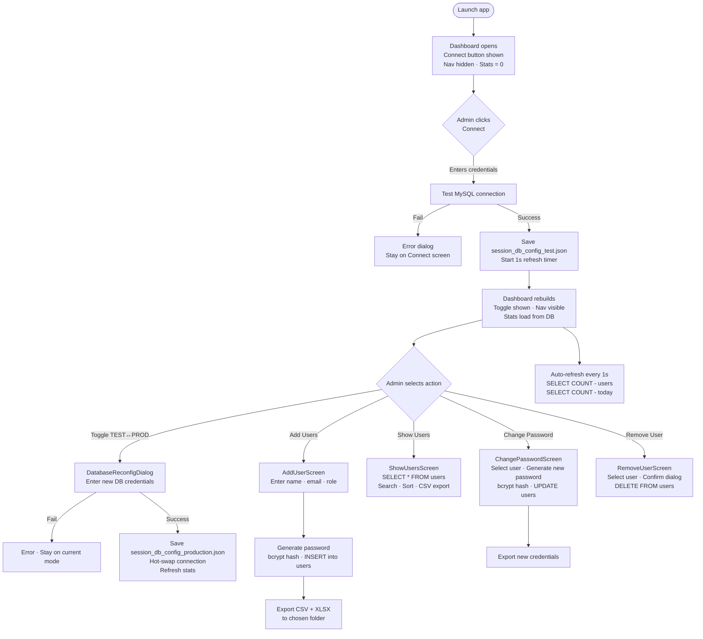
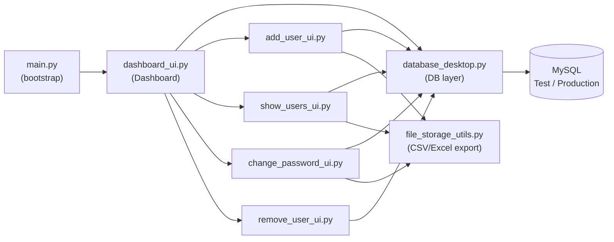

# Identity Manager


**A Windows desktop application for secure user account management — built with PyQt6 and MySQL.**

Developed for **Closets By Design** to manage user identities across isolated Test and Production MySQL environments from a single clean interface.

---

## Table of Contents

- [Overview](#overview)
- [How It Works](#how-it-works)
- [System Flow](#system-flow)
- [Features](#features)
- [Tech Stack](#tech-stack)
- [Installation](#installation)
- [Running the App](#running-the-app)
- [Connecting to a Database](#connecting-to-a-database)
- [User Operations](#user-operations)
- [Database Schema](#database-schema)
- [File Structure](#file-structure)
- [Building the Executable](#building-the-executable)
- [Troubleshooting](#troubleshooting)

---

## Overview

Identity Manager is a PyQt6 desktop application that gives administrators a clean, professional interface for managing user accounts stored in a MySQL database. It supports two completely independent database environments — **Test** and **Production** — switchable at runtime without restarting.

The app is designed around a simple principle: **no connection = no data**. The dashboard launches immediately but shows zero stats and hides all navigation until a database connection is established. This prevents accidental operations on the wrong environment and makes the current state obvious at a glance.

---

## How It Works

### Startup

When launched, the app skips any splash screen and goes directly to the dashboard. In the top-right corner a green **Connect** button is shown. All navigation buttons (Add Users, Show Users, etc.) are hidden. Stats cards display `0`.

### Connection

Clicking **Connect** opens a dialog where the administrator enters MySQL credentials (host, port, database name, username, password). The app tests the connection before accepting it. On success:

- The **Connect** button is replaced by the **TEST / PROD toggle switch**
- Navigation buttons become visible
- Stats cards are populated with live data from the database
- A 1-second auto-refresh timer starts updating stats

### Environment Switching (TEST ↔ PROD)

The iOS-style toggle in the top-right corner shows the current active environment. Clicking it opens a reconnection dialog where the administrator enters credentials for the other environment. On success the app hot-swaps the database connection — no restart needed. The toggle animates to reflect the new state.

### User Operations

From the dashboard, the administrator can:

| Button | Action |
|---|---|
| ➕ Add Users | Create a new user account; system generates a bcrypt-hashed password and exports credentials to CSV/Excel |
| 👥 Show Users | Browse, search, and export the full user list |
| 🔑 Change Password | Regenerate the password for any selected user |
| 🗑️ Remove User | Delete a user account with confirmation |

Each operation opens in its own window and reads/writes directly to the active MySQL database.

### Password Generation

Passwords are generated programmatically using Python's `secrets` module (via `utils.py`). They are immediately hashed with `bcrypt` before being written to the database. The plaintext password is shown once and saved to the credential export files.

### Export

When a user is added or a password changed, the app prompts for a download folder and writes:
- A per-user `.xlsx` file with username, email, role, and generated password
- An append-only `all_users_data.csv` consolidated log

---

## System Flow



### Module Interaction



---

## Features

- **Dual environment support** — Test and Production MySQL databases, switchable via an iOS-style toggle with no restart
- **Connection-gated UI** — nav buttons and stats are hidden until a verified DB connection exists
- **Live stats** — Total Users and Added Today auto-refresh every second from the `users` table
- **Add Users** — bcrypt-hashed password generation, credentials exported to CSV and Excel
- **Show Users** — searchable, sortable full user table with CSV export
- **Change Password** — regenerates and exports a new password for any user
- **Remove User** — safe deletion with a confirmation dialog
- **Configurable export paths** — download folder preference saved per session
- **Windows taskbar icon** — set via direct `WM_SETICON` WinAPI call for reliable display across all Windows versions

---

## Tech Stack

| Layer | Technology |
|---|---|
| UI Framework | PyQt6 |
| Language | Python 3.10+ |
| Database | MySQL 8.0+ via `mysql-connector-python` |
| Password Hashing | `bcrypt` |
| Data Export | `pandas`, `openpyxl` |
| Build | PyInstaller (onedir) |
| Platform | Windows 10/11 |

---

## Installation

### Prerequisites
- Python 3.10+
- MySQL Server 8.0+
- Windows 10/11

### 1. Clone the repository
```bash
git clone https://github.com/NumlyticsLLP/closets-back-end.git
cd "PASSWORD GENERATOR"
```

### 2. Create and activate a virtual environment
```bash
python -m venv .venv
.venv\Scripts\activate
```

### 3. Install dependencies
```bash
pip install -r requirements.txt
```

---

## Running the App

```bash
python main.py
```

The dashboard opens immediately. Click **Connect** to enter your MySQL credentials.

---

## Connecting to a Database

Click the **Connect** button and fill in:

| Field | Example |
|---|---|
| Host | `localhost` |
| Port | `3306` |
| Database Name | `user_management_test` |
| Username | `root` |
| Password | `your_password` |

The connection is tested before the dashboard unlocks. A failed attempt shows an error and lets you retry.

To switch environments at runtime, click the **TEST / PROD** toggle and enter credentials for the target database.

---

## User Operations

### Add a User
1. Click **➕ Add Users**
2. Enter full name, email address, and role (`user` or `admin`)
3. Click **Add User** — the app generates a secure password, stores it hashed in the DB, and prompts for an export folder
4. Credentials are saved to `user_<name>_<timestamp>.xlsx` and appended to `all_users_data.csv`

### Show Users
1. Click **👥 Show Users**
2. The full `users` table loads in a searchable, sortable grid
3. Click **Download CSV** to export the current view

### Change a Password
1. Click **🔑 Change Password**
2. Select the user from the dropdown
3. Click **Change Password** — a new secure password is generated, hashed, and saved
4. New credentials are exported to file

### Remove a User
1. Click **🗑️ Remove User**
2. Select the user from the dropdown
3. Read the warning and click **Remove User**
4. Confirm in the popup — the record is permanently deleted

---

## Database Schema

```sql
CREATE TABLE users (
    id          INT AUTO_INCREMENT PRIMARY KEY,
    email       VARCHAR(255) UNIQUE NOT NULL,
    name        VARCHAR(255) NOT NULL,
    password    VARCHAR(255) NOT NULL,        -- bcrypt hash
    role        ENUM('user', 'admin') DEFAULT 'user',
    created_at  TIMESTAMP DEFAULT CURRENT_TIMESTAMP,
    updated_at  TIMESTAMP DEFAULT CURRENT_TIMESTAMP ON UPDATE CURRENT_TIMESTAMP,
    INDEX idx_email (email),
    INDEX idx_created_at (created_at)
);
```

**Dashboard statistics queries:**
```sql
-- Total Users card
SELECT COUNT(*) FROM users;

-- Added Today card
SELECT COUNT(*) FROM users WHERE DATE(created_at) = CURDATE();
```

---

## File Structure

```
PASSWORD GENERATOR/
├── main.py                      # Entry point — QApp bootstrap, WinAPI icon, WM_SETICON
├── dashboard_ui.py              # Dashboard, stats cards, iOS toggle, connection dialogs
├── database_desktop.py          # All MySQL operations — connect, CRUD, stats, session config
├── add_user_ui.py               # Add user screen
├── show_users_ui.py             # User table — search, sort, CSV export
├── change_password_ui.py        # Password reset screen
├── remove_user_ui.py            # User deletion screen with confirmation
├── login_ui.py                  # Admin login screen (mode-aware)
├── file_storage_dialog.py       # Download folder selector dialog
├── file_storage_utils.py        # CSV and Excel export helpers
├── mode_selection_dialog.py     # Legacy mode selection dialog
├── config.py                    # DB config loader helpers
├── utils.py                     # Secure password generation (secrets module)
├── mode_configurations.json     # Mode display labels and colors
├── app_icon.ico                 # Multi-size application icon (16–256px)
├── fixed.spec                   # PyInstaller onedir build spec
├── requirements.txt
├── .gitignore
└── assets/
    ├── Logo 1.png               # Full logo with text
    └── Logo without text.png    # Icon-only logo (source for app_icon.ico)
```

---

## Building the Executable

The project uses a **onedir** PyInstaller build. Unlike onefile, this layout extracts files once at build time — the EXE finds them in the same folder at runtime, giving a 1–3 second startup instead of 10–20 seconds.

```bash
pyinstaller --clean fixed.spec
```

**Output:** `dist\IdentityManager\IdentityManager.exe`

To distribute, zip and share the entire `dist\IdentityManager\` folder. The EXE cannot run without the accompanying files.

> **Icon note:** The icon is embedded via `--icon=app_icon.ico` in the spec file **and** applied at runtime by calling `LoadImageW` + `SendMessageW(WM_SETICON)` directly on the native HWND after `show()`. This two-step approach is required because PyQt's `setWindowIcon` alone does not reliably update the Windows shell taskbar.

---

## Troubleshooting

### App opens but stats show 0 and nav is hidden
Expected — the dashboard starts disconnected. Click **Connect** and enter valid MySQL credentials to unlock the UI.

### Connection dialog fails
- Verify MySQL is running: `Get-Service -Name "*mysql*"`
- Double-check host, port, database name, username, and password
- Ensure the specified database exists and the user has `SELECT`, `INSERT`, `UPDATE`, `DELETE` privileges

### EXE opens slowly
You are likely using a onefile build. Use the **onedir** output at `dist\IdentityManager\IdentityManager.exe` — it starts in 1–3 seconds because no extraction step happens at runtime.

### Taskbar icon is missing or blurry
- Missing: The icon is applied via `WM_SETICON` after `show()`. If it doesn't appear, restart the app or right-click the taskbar button → **Pin to taskbar**
- Blurry: Regenerate `app_icon.ico` by running `python make_icon.py` (requires Pillow). The script builds a sharpened multi-size ICO from `assets/Logo without text.png`

### Wrong database environment active
Check the toggle in the top-right corner of the dashboard. **Green = TEST**, **Orange = PRODUCTION**. Click the toggle to switch and enter credentials for the target database.

---

*Last updated: February 18, 2026*
